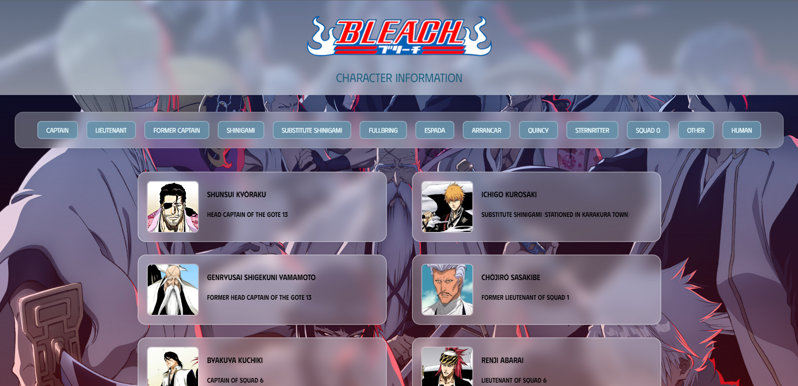

# Bleach Character Dictionary

<div align="center">
  
</div>

## Table of Contents

- [Introduction](#introduction)
- [Features](#features)
- [Prerequisites](#prerequisites)
- [Installation](#installation)
- [Usage](#usage)
- [Contributing](#contributing)

## Introduction

Welcome to the Bleach Character Dictionary Web App! This is a web application that provides a comprehensive dictionary of characters from the popular anime and manga series "Bleach." Whether you're a long-time fan of the series or a newcomer, this app allows you to explore and learn about your favorite characters from the Bleach universe.

## Features

- Select and find out more about some of the most iconic Bleach Characters.
- Sort Characters based on their Affiliation.
- Access detailed information about each character, including their name, description, and abilities.
- User-friendly and responsive web interface built using React for the front end.
- Server-side functionality powered by Node.js and Express.
- Easy-to-follow installation and usage instructions.

## Prerequisites

Before you get started with the Bleach Character Dictionary Web App, make sure you have the following prerequisites:

- Node.js: Make sure you have Node.js installed on your system. You can download it from [nodejs.org](https://nodejs.org/).

## Installation

1. Clone the repository to your local machine:

 ```bash
 git clone https://github.com/your-username/bleach-character-dictionary.git
 ```

## Usage

To start the Bleach Character Dictionary Web App, follow these steps:

1. Start the backend server (Express):

  ```bash
  npm start
```
The server should start on port 5000.

2. Start the frontend development server (React):

   ```bash
    # Navigate to the client directory
    cd client
  
    # Start the React development server
    npm start
    ```
The frontend development server should start on port 3000 and open your default web browser to the app.

3. You can now access the web app by opening your web browser and navigating to http://localhost:3000.

Feel free to explore the app, select your favorite Bleach characters, and learn more about them.

## Contributing

If you'd like to contribute to this project or report issues, please follow these steps:

1. Fork the repository on GitHub.
2. Create a new branch with a descriptive name for your feature or fix.
3. Make your changes and commit them with clear and concise messages.

   ```bash
    # Example of commit messages
    git commit -m "feat: Added new character information page"
    git commit -m "fix: Fixed search functionality"
   ```
4. Push your changes to your fork on GitHub.
5. Create a pull request to the main repository's main branch.

